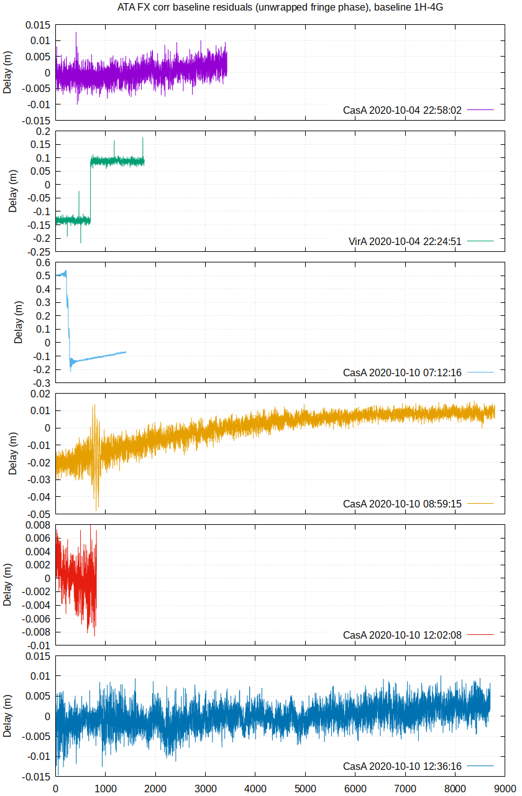

# ATA-FX
> A simple software correlator to test interferometry at the Alan Telescope Array

## Table of Contents

* [Introduction](#Introduction)
* [Results](#Results)
* [Usage](#Usage)
* [TODO](#Todo)

## Introduction

This project is a simple cross correlation engine based on GNU Radio.
It performs corrections for geometric delay, fringe rotation, and fractional delay. Even though we are still
refining the baseline coordinates, this approach centers and stops the fringe, and permits integration times in the order
of several minutes. The output product is a cross-spectrum with a configurable integration time and number of lags. 
The result can both be written to file, and viewed in realtime.
The realtime display shows the fringe peak (in the lag domain) and the phase over the frequency bins.


## Results

So far, we've been mostly using ATA antennas 1H and 4G. We get very nice fringes on CasA and VirA on those. Weaker sources
such as 3C84 can also be detected well.
Using the software in this repository, it's possible to calculate the delay change by unwrapping the fringe
phase, and multiplying it with the wavelength of the observation. This is then compared against the
predicted baseline length, calculated from the inner product of the (rotated) baseline, and the source location
on the sky. Ideally, the fringe phase should match the predicted baseline, resulting in a flat residual over
each observation. As the fringe phase only provides a relative measurement, the constant offset in each
observation is removed.

As the plot below shows, for most of the observations, the residuals are below the cm level. The observation
on VirA encountered a phase slip, and the first observation on CasA on 2020-10-10 had error reports from the USRP.

These residual plots have been used to improve the baseline vector, which for this pair of dishes is
```
baseline = (-172.922, -56.792, -160.605) m
```



## Usage

This software is not yet fully ready to use, but can be used as a starting point for more exploration.

* Steer two dishes to track the same source
* Configure the switch matrix
* Set observing frequency to 1350 MHz
* Compile the flowchart to python, copy the python file to the ATA
* Once the array is on source, run the compiled flowchart, which will record the data
* In a second shell, start the 'ATA-delay-XMLRPC.py' which calculates the predicted delays
* The fringe can be viewed in real time using the included flowgraph 'ATA-ZMQ-display.grc'
* Add the recording to the source of 'baseline-phase.py' and run it, writing the results to 'file 'baseline-residuals'
* Edit the plot file and then run 'gnuplot baseline-phase-residuals.gpi' to create a graph
* Note: due to their size, observation data hasn't been included.

## TODO

Lots of TODOs, this software is very experimental

* Use both polarizations, and also compute autocorrelations
* Determine baseline vectors for the dishes that we can use
* Record simple sources over multiple baselines
* Try imaging the data
